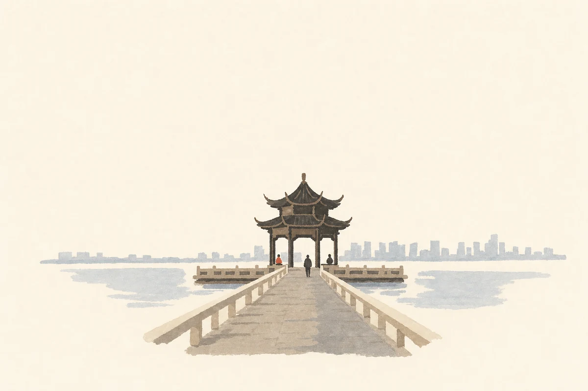
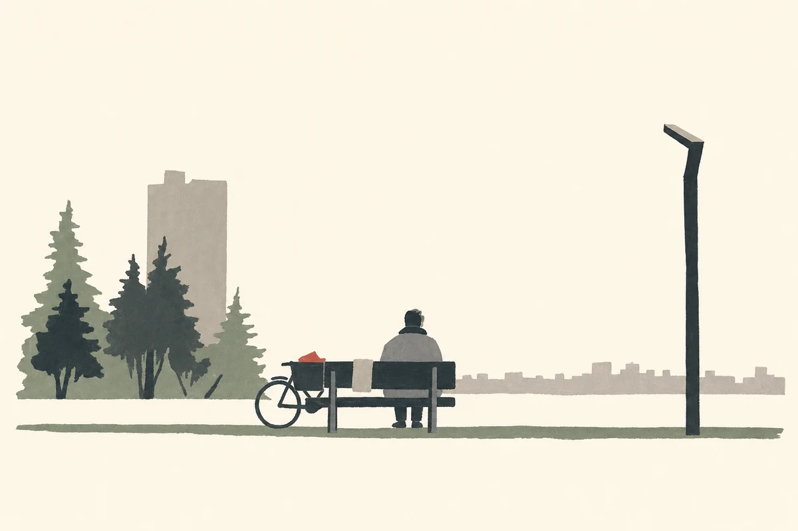
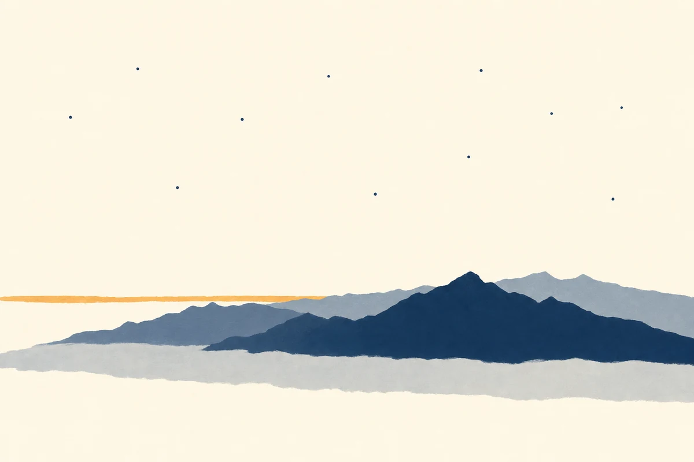
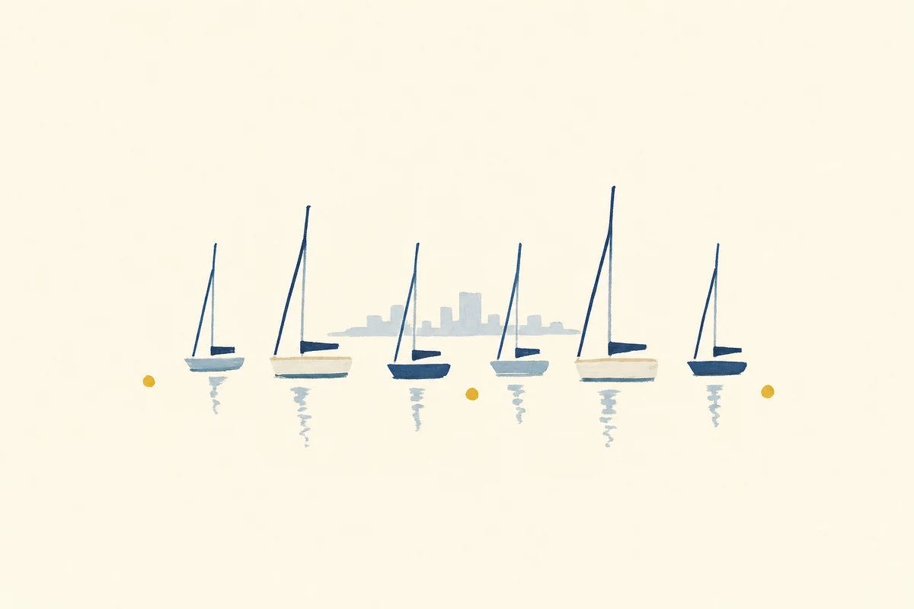
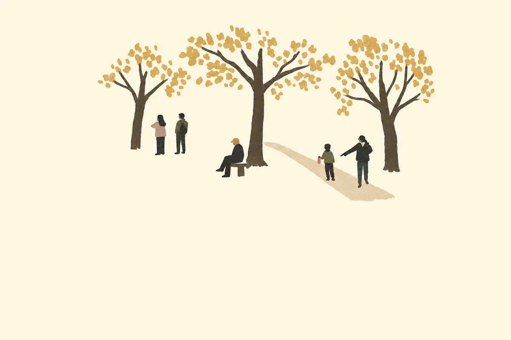
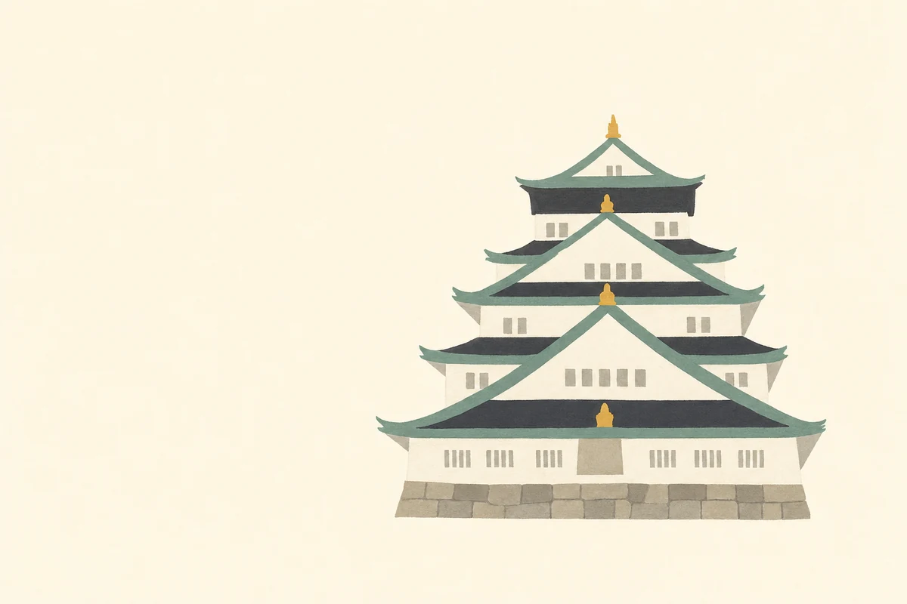
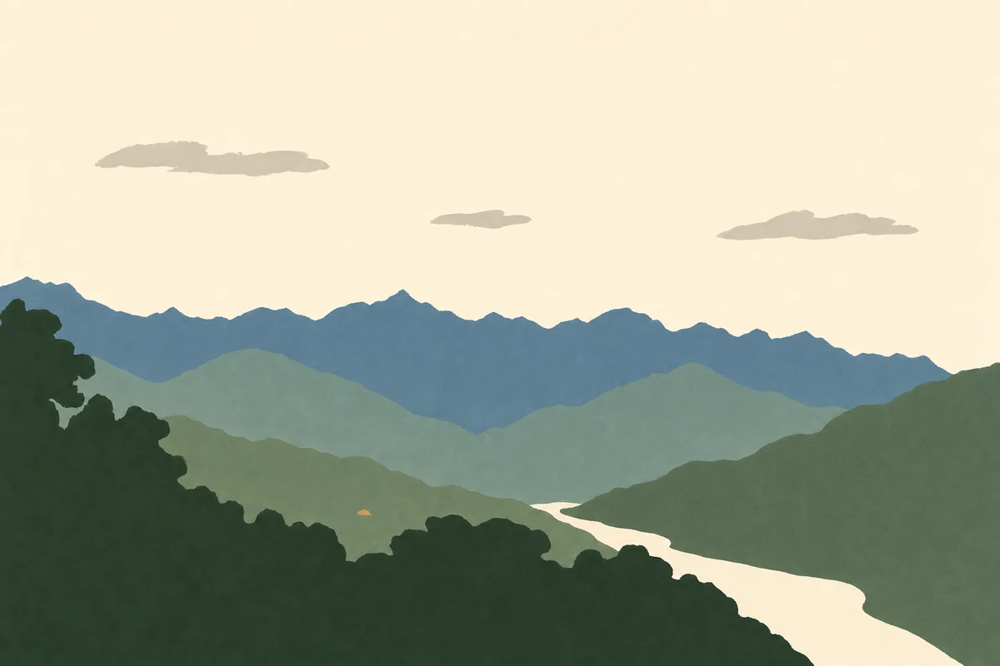
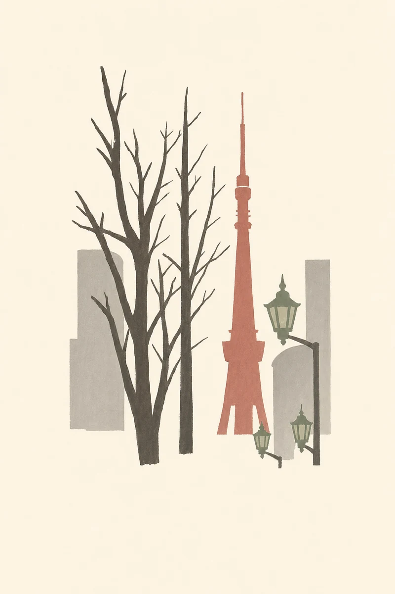

# Editorial Vision Studio

**Language:** [繁體中文](README.md) | English

AI creative direction engine for editorial image generation, visual planning, and model-ready prompt writing.

Editorial Vision Studio helps you turn a theme, photo, brand idea, or rough reference into a clear visual direction: intent, visual language, layout, style DNA, recovery strategy, and a prompt that can be pasted into GPT Image, Flux, Ideogram, or another image model.

## Example Style

These eight finished pieces are all output of the **[`ivory-postcard`](presets/ivory-postcard.md) preset**: a photograph used as content reference and reconstructed as a minimal postcard — ivory paper ground, generous negative space, restrained geometry, simplified marks, muted palette. This is not a photo filter; the workflow selects the subject, removes detail, and rebuilds the composition.

This is **one preset, not the engine's default**. Ground and medium are set by the required `ground` and `render_mode` fields, which have no fallback value. Two other presets ship with the repo: [`vintage-travel-poster`](presets/vintage-travel-poster.md) (saturated ink field, flat graphic shapes) and [`papercraft-diorama-postcard`](presets/papercraft-diorama-postcard.md) (photograph as ground, papercraft diorama). Full list: [presets/registry.md](presets/registry.md).

<p>
  
  
</p>
<p>
  
  
</p>
<p>
  
  
</p>
<p>
  
  
</p>

## What It Does

- **Asks which look you want, up front** — ivory postcard, period travel poster, papercraft diorama, describe your own, or let the engine propose. Asked once, reused for the session.
- Resolves the user goal into an output family such as gallery print, poster, campaign key visual, product editorial, website hero, zine, or moodboard.
- Analyzes the visual language before choosing a style, so the result is driven by intent instead of random style words.
- Plans layout, typography, palette, abstraction level, texture permission, and recovery fixes.
- Converts the plan into model-ready prompts through adapters for GPT Image, Flux, Ideogram, or generic tools.
- Reviews the prompt for conflicts, such as MUJI with heavy type, gallery print with dense typography, or non-zine layouts using riso texture.
- Proposes two or three competing art directions, each with a thesis and a trade-off, then commits to one and keeps the runner-up switchable.
- Scores the result across ten dimensions after generation and fixes only the single layer responsible, up to three passes.
- Remembers a visual system so the second and tenth image read as the same publication: style, palette, typography, and texture tier stay locked while layout and composition adapt per image.
- Expands one visual system into a full set: campaign at every size, carousels, multi-page decks.
- Keeps spatial relationships when it simplifies a photograph: one projection, one ground plane, one light with contact shadows — a cluster does not come back as a row of isolated objects.

## Quick Prompt

The first thing a run does is ask which look you want — ivory postcard, period travel poster, papercraft diorama, or let the engine propose after seeing your material. Asked once, reused for the session.

To skip the menu and name it directly:

```text
preset: ivory-postcard
```

To paste straight into a model without the engine, use the block below. It is the `ivory-postcard` compiler anchor verbatim — [presets/ivory-postcard.md](presets/ivory-postcard.md) is the single source of truth; if the two ever diverge, the preset wins.

```text
Minimal editorial illustration on a warm ivory paper ground, flat and uniform,
no grain or stain. Rebuild the scene using three to five kinds of simplified
form, repeated as often as the scene needs; keep the arrangement the
photograph had — objects that clustered still cluster, overlaps and relative
sizes survive. Single flat elevation viewpoint held across every object, never
two angles within one object. All objects rest on one shared ground plane; one
light from the upper left, and every object casts a flat contact shadow in
that direction, one or two steps darker than the ground, never black. Subject
reduced and placed upper-centre with at least 55 percent quiet empty field.
Opaque paint-like colour areas, dabbed and brush-made, with slightly uneven
edges and faint tonal variation inside each shape; repeated elements differ
slightly from one another; no vector-clean outlines and zero photographic
surface detail. Palette: warm ivory, charcoal brown, one muted earth tone, one
cool neutral, plus at most one small muted chroma focus — never a saturated
anchor. Type optional: a single small fine serif title at the lower margin.
Avoid photographic realism, translucent overlays, deep perspective recession
and converging vanishing points, objects floating with no contact shadow, a
row of isolated objects where the source had a cluster, wires, dense window
grids, glossy gradients, neon, cover furniture, watermark, extra text.
```

### Style Lock for Reference Photos

When a supplied photo keeps producing a faded or overly detailed result, describe it as a **content reference**, not an image that must be preserved. State the abstraction rules explicitly:

```text
Use the supplied photo only as a content reference. Do not preserve its photographic detail, lighting, perspective, or texture.
Choose only the most recognizable scene cues and redraw them as independent, flat editorial marks.
Do not make a magazine cover. Do not add a frame, barcode, cover lines, or headline unless requested.
```

## Recommended Workflow

1. Define the intent.

   Example: `gallery print`, `editorial poster`, `brand key visual`, `website hero`, or `social asset`.

2. Pick a look.

   The first question a run asks. Choose a shipped preset, describe what you want in your own words, or let the engine propose after seeing your material. Asked once.

3. Choose the visual language.

   Example: `Museum`, `Architectural`, `Product Stillness`, `Quiet Human`, `Urban Documentary`.

4. Commit to an art direction.

   A preset or a description at step 2 settles this silently. Only "let the engine propose" shows two or three directions to choose between.

5. Set the layout and composition inside that direction.

   Example: `Gallery Print + MUJI`, `Swiss Poster + Architectural`, `Magazine Cover + Kinfolk`.

6. Compile a model prompt.

   Use the files in `adapters/` to translate the same visual plan for GPT Image, Flux, Ideogram, or a generic image tool.

7. Review before generation.

   Check that ground, render mode, typography, texture, palette, and layout do not contradict each other.

8. Score and iterate after generation.

   Find the lowest-scoring dimension, fix the one layer responsible, recompile, regenerate.

9. Lock the system for a set.

   Once the first image passes, lock style, palette, typography, and texture tier so every later image inherits them.

## Prompt Recipes

### Minimal Editorial City

```text
Vertical 1:1 editorial illustration on warm ivory paper.
A simplified city skyline at dusk, built from flat rectangular blocks and one iconic central arch-like structure.
Tiny human silhouettes form a quiet rhythm at the bottom edge.
Muted navy, dusty violet, coral, and ochre palette.
Small centered serif title: "City Dusk".
Avoid photorealism, complex perspective, dense windows, glossy effects, watermark.
```

### Quiet Architecture Poster

```text
Portrait 3:4 minimal architectural editorial poster.
A tall abstract tower made of stacked pale gray volumes, centered on an ivory background.
Thin perspective guide lines lead toward the base.
One small green-black color anchor near the lower left of the tower.
Refined serif title near the bottom: "Vertical Morning".
Avoid realistic glass, dramatic sky, crowds, shadows, texture noise, watermark.
```

### Museum Bridge Study

```text
Landscape 4:3 gallery-print illustration.
A long bridge crossing quiet water, reduced to soft gray lines, warm ochre arches, and a small pavilion silhouette.
Large untouched ivory space above the bridge.
Loose horizontal water marks below, controlled and sparse.
Small elegant serif caption near the lower margin: "Bridge Holds Light".
Avoid realism, heavy outline, saturated blue, decorative pattern, watermark.
```

### Tokyo Tower, Reconstructed

```text
Portrait 3:4 minimal editorial gallery illustration, not a photo-to-illustration conversion.
Use a Tokyo Tower street photo only as content reference. Reconstruct the scene using four symbolic elements: one muted brick-red tower silhouette, three charcoal-brown bare tree trunks, a few soft gray building blocks, and small sage-green lantern accents.
Use opaque flat gouache marks on an ivory paper ground. Keep the scene small in the upper-middle, leaving at least 55% empty space. Add one small serif caption near the lower margin: "Tower at Dusk".
Avoid wires, realistic tower latticework, glass reflections, dense windows, detailed shadows, photographic texture, transparent overlays, borders, magazine-cover typography, watermark.
```

## Repository Map

```text
.
├── SKILL.md                 # Full Codex skill entrypoint
├── presets/                 # Shipped fixed templates: ivory postcard, travel poster, papercraft diorama
├── prompts/                 # Intent, style gate, style brief, analyzer, art direction, planner, compiler, reviewer, evaluator, iteration, visual memory, series
├── styles/                  # Style DNA: Swiss, MUJI, Kinfolk, Monocle, COS, and more
├── layouts/                 # Output families such as poster, zine, gallery, hero, campaign
├── adapters/                # Model-specific prompt adapters
├── recovery/                # Targeted fixes for weak contrast, subject, palette, geometry
├── assets/                  # Ground and render mode, scene construction, palette, typography, texture rules, examples
├── reference/               # Architecture and decision tree
└── spec/                    # EditorialSpec, VisualManifest, and VisualMemory schemas
```

## Install as a Codex Skill

Copy or symlink this repository into your Codex skills directory:

```bash
mkdir -p ~/.codex/skills
cp -R editorial-vision-studio ~/.codex/skills/editorial-vision-studio
```

Then ask Codex for work such as:

```text
Use editorial-vision-studio to turn this photo into a quiet gallery print prompt.
```

## Design Notes

- The system is intentionally model-agnostic. Keep visual logic in the EditorialSpec, then translate it through adapters.
- Texture is controlled by layout. Riso, halftone, xerox, and scan-noise language belongs to zine-like outputs, not clean gallery or product layouts.
- Recovery should be targeted. Fix contrast, focus, geometry, palette, or background only when the image report shows a weakness.
- For exact in-image text, keep it short and place it explicitly.

## License

MIT

## Author

Max Wang  
GitHub: <https://github.com/Yu-0312>
