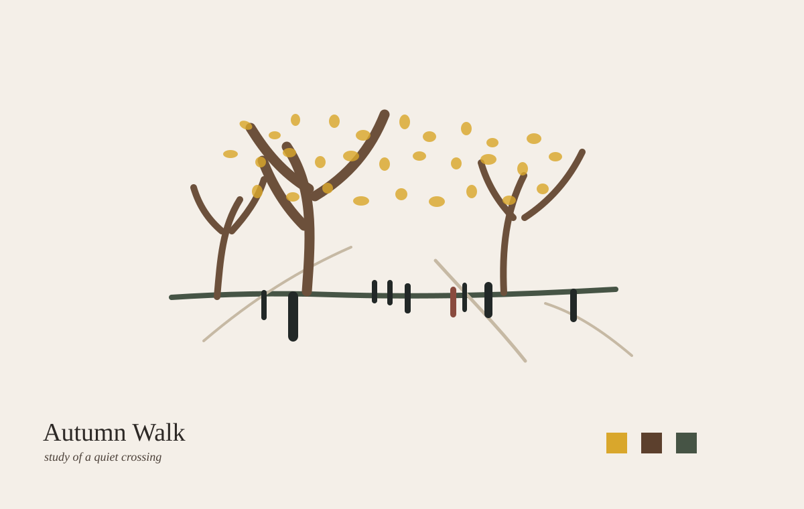
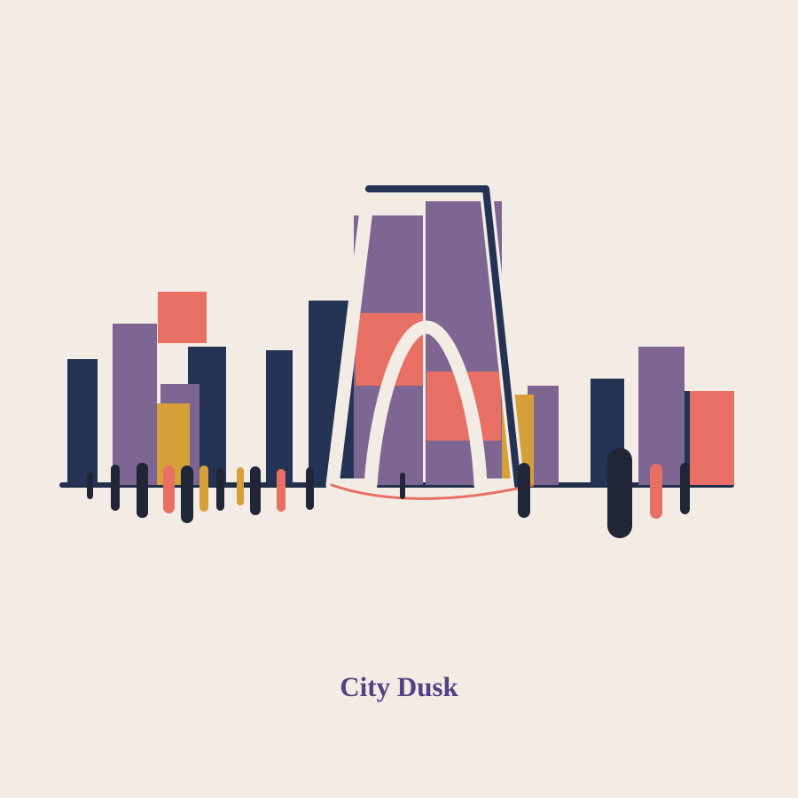
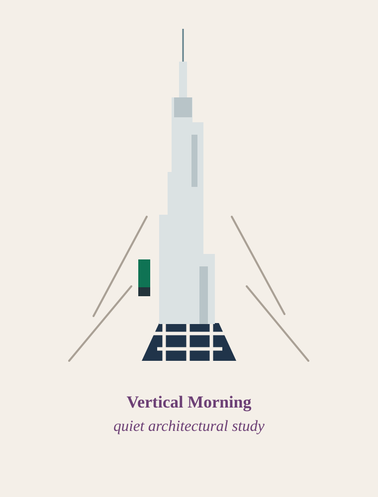
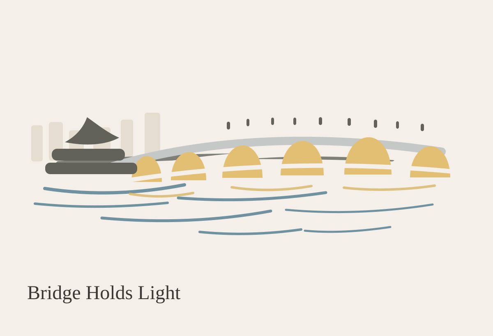

# Editorial Vision Studio

**Language:** English | [繁體中文](README.zh-TW.md)

AI creative direction engine for editorial image generation, visual planning, and model-ready prompt writing.

Editorial Vision Studio helps you turn a theme, photo, brand idea, or rough reference into a clear visual direction: intent, visual language, layout, style DNA, recovery strategy, and a prompt that can be pasted into GPT Image, Flux, Ideogram, or another image model.

## Example Style

The examples below show a quiet editorial illustration direction: ivory paper ground, high negative space, restrained geometry, simplified marks, muted palette, and small serif captions.

<p>
  
  
</p>
<p>
  
  
</p>

## What It Does

- Resolves the user goal into an output family such as gallery print, poster, campaign key visual, product editorial, website hero, zine, or moodboard.
- Analyzes the visual language before choosing a style, so the result is driven by intent instead of random style words.
- Plans layout, typography, palette, abstraction level, texture permission, and recovery fixes.
- Converts the plan into model-ready prompts through adapters for GPT Image, Flux, Ideogram, or generic tools.
- Reviews the prompt for conflicts, such as MUJI with heavy type, gallery print with dense typography, or non-zine layouts using riso texture.

## Quick Prompt

Use this prompt when you want the minimal editorial illustration style shown above.

```text
Create a minimal editorial gallery illustration, not a photo-to-illustration conversion.
Reconstruct the scene with only three to five simplified symbolic forms on an ivory paper ground.
Use opaque, flat gouache-like marks with gently irregular hand-painted edges; preserve no photographic surface detail.
Composition: keep the motif small and centered in the upper-middle of the canvas, with at least 55% calm empty space.
Palette: warm ivory, charcoal brown, one muted earthy accent, one cool neutral, and at most one small color anchor.
Typography: optional; one small refined serif caption near the lower margin with the exact title "[TITLE]".
Avoid: photorealism, transparent overlays, realistic perspective, wires, dense windows, detailed latticework, glossy gradients, neon, magazine-cover layout, watermark, fake logo, extra text.
```

### Style Lock for Reference Photos

When a supplied photo keeps producing a faded or overly detailed result, describe it as a **content reference**, not an image that must be preserved. State the abstraction rules explicitly:

```text
Use the supplied photo only as a content reference. Do not preserve its photographic detail, lighting, perspective, or texture.
Choose only the most recognizable scene cues and redraw them as independent, flat editorial marks.
Do not make a magazine cover. Do not add a frame, barcode, cover lines, or headline unless requested.
```

## Recommended Workflow

1. Define the intent.

   Example: `gallery print`, `editorial poster`, `brand key visual`, `website hero`, or `social asset`.

2. Choose the visual language.

   Example: `Museum`, `Architectural`, `Product Stillness`, `Quiet Human`, `Urban Documentary`.

3. Select the layout and style DNA.

   Example: `Gallery Print + MUJI`, `Swiss Poster + Architectural`, `Magazine Cover + Kinfolk`.

4. Compile a model prompt.

   Use the files in `adapters/` to translate the same visual plan for GPT Image, Flux, Ideogram, or a generic image tool.

5. Review before generation.

   Check that typography, texture, palette, and layout do not contradict each other.

## Prompt Recipes

### Minimal Editorial City

```text
Vertical 1:1 editorial illustration on warm ivory paper.
A simplified city skyline at dusk, built from flat rectangular blocks and one iconic central arch-like structure.
Tiny human silhouettes form a quiet rhythm at the bottom edge.
Muted navy, dusty violet, coral, and ochre palette.
Small centered serif title: "City Dusk".
Avoid photorealism, complex perspective, dense windows, glossy effects, watermark.
```

### Quiet Architecture Poster

```text
Portrait 3:4 minimal architectural editorial poster.
A tall abstract tower made of stacked pale gray volumes, centered on an ivory background.
Thin perspective guide lines lead toward the base.
One small green-black color anchor near the lower left of the tower.
Refined serif title near the bottom: "Vertical Morning".
Avoid realistic glass, dramatic sky, crowds, shadows, texture noise, watermark.
```

### Museum Bridge Study

```text
Landscape 4:3 gallery-print illustration.
A long bridge crossing quiet water, reduced to soft gray lines, warm ochre arches, and a small pavilion silhouette.
Large untouched ivory space above the bridge.
Loose horizontal water marks below, controlled and sparse.
Small elegant serif caption near the lower margin: "Bridge Holds Light".
Avoid realism, heavy outline, saturated blue, decorative pattern, watermark.
```

### Tokyo Tower, Reconstructed

```text
Portrait 3:4 minimal editorial gallery illustration, not a photo-to-illustration conversion.
Use a Tokyo Tower street photo only as content reference. Reconstruct the scene using four symbolic elements: one muted brick-red tower silhouette, three charcoal-brown bare tree trunks, a few soft gray building blocks, and small sage-green lantern accents.
Use opaque flat gouache marks on an ivory paper ground. Keep the scene small in the upper-middle, leaving at least 55% empty space. Add one small serif caption near the lower margin: "Tower at Dusk".
Avoid wires, realistic tower latticework, glass reflections, dense windows, detailed shadows, photographic texture, transparent overlays, borders, magazine-cover typography, watermark.
```

## Repository Map

```text
.
├── SKILL.md                 # Full Codex skill entrypoint
├── prompts/                 # Intent, analyzer, planner, compiler, reviewer, evaluator
├── styles/                  # Style DNA: Swiss, MUJI, Kinfolk, Monocle, COS, and more
├── layouts/                 # Output families such as poster, zine, gallery, hero, campaign
├── adapters/                # Model-specific prompt adapters
├── recovery/                # Targeted fixes for weak contrast, subject, palette, geometry
├── assets/                  # Palette, typography, texture rules, and examples
├── reference/               # Architecture and decision tree
├── references/              # Reusable photo-abstract prompts
└── spec/                    # EditorialSpec schema
```

## Install as a Codex Skill

Copy or symlink this repository into your Codex skills directory:

```bash
mkdir -p ~/.codex/skills
cp -R editorial-vision-studio ~/.codex/skills/editorial-vision-studio
```

Then ask Codex for work such as:

```text
Use editorial-vision-studio to turn this photo into a quiet gallery print prompt.
```

## Design Notes

- The system is intentionally model-agnostic. Keep visual logic in the EditorialSpec, then translate it through adapters.
- Texture is controlled by layout. Riso, halftone, xerox, and scan-noise language belongs to zine-like outputs, not clean gallery or product layouts.
- Recovery should be targeted. Fix contrast, focus, geometry, palette, or background only when the image report shows a weakness.
- For exact in-image text, keep it short and place it explicitly.

## License

MIT

## Author

Max Wang  
GitHub: <https://github.com/Yu-0312>
